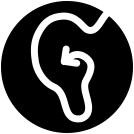

<!-- PROJECT LOGO -->
<br />
<p align="center">

   <! --  -->

  <h1 align="center">Narrate My Way</h1>

  <p align="center">
    Narrate points of interest in your surroundings.
    <br />
    <a href="https://ese-peasy.github.io/NarrateMyWay/"><strong>Explore the docs »</strong></a>
    <br />
    <br />
    <a href="https://github.com/ESE-Peasy/NarrateMyWay">View Demo</a>
    ·
    <a href="https://github.com/ESE-Peasy/NarrateMyWay/issues">Report Bug</a>
    ·
    <a href="https://github.com/ESE-Peasy/NarrateMyWay/issues">Request Feature</a>
  </p>
</p>


<!-- TABLE OF CONTENTS -->
<details open="open">
  <summary>Table of Contents</summary>
  <ol>
    <li>
      <a href="#about-the-project">About The Project</a>
      <ul>
        <li><a href="#components-used">Components Used</a></li>
        <li><a href="#built-with">Built With</a></li>
      </ul>
    </li>
    <li>
      <a href="#getting-started">Getting Started</a>
      <ul>
        <li><a href="#prerequisites">Prerequisites</a></li>
        <li><a href="#installation">Installation</a></li>
      </ul>
    </li>
    <li><a href="#usage">Usage</a></li>
    <li><a href="#roadmap">Roadmap</a></li>
    <li><a href="#contributing">Contributing</a></li>
    <li><a href="#license">License</a></li>
    <li><a href="#contact">Contact</a></li>
    <li><a href="#acknowledgements">Acknowledgements</a></li>
  </ol>
</details>


<!-- ABOUT THE PROJECT -->
## About The Project

To be completed

### Components Used

*
*
*
### Built With

* <!-- [Bootstrap](https://getbootstrap.com) -->
* <!-- [JQuery](https://jquery.com) -->
* <!-- [Laravel](https://laravel.com) -->


<!-- GETTING STARTED -->
## Getting Started

To get PosturePerfection running by yourself you will need to follow these steps.

### Prerequisites

Specify which software dependencies are used and how to install them:

  ```sh
  TBC
  ```

### Installation

1. Fork the repo
2. Clone the repo
   ```sh
   git clone https://github.com/ESE-Peasy/NarrateMyWay.git
   ```
3. Install NPM packages
   ```sh
   TBC
   ```


<!-- USAGE EXAMPLES -->
## Usage

* Include screenshots, video demos and code examples to demonstrate how the project works

_For more examples, please refer to the [Documentation](https://example.com)_


<!-- ROADMAP -->
## Roadmap

See the [open issues](https://github.com/ESE-Peasy/NarrateMyWay/issues) for a list of proposed features (and known issues).


<!-- CONTRIBUTING -->
## Contributing

Contributions are what make the open source community such an amazing place to be learn, inspire, and create. Any contributions you make are **greatly appreciated**.

1. Fork the Project
2. Create your Feature Branch (`git checkout -b feature/AmazingFeature`)
3. Commit your Changes (`git commit -m 'Add some AmazingFeature'`)
4. Push to the Branch (`git push origin feature/AmazingFeature`)
5. Open a Pull Request


<!-- LICENSE -->
## License

Distributed under the GPL-3.0 License. See [`LICENSE`](https://github.com/ESE-Peasy/NarrateMyWay/blob/main/LICENSE) for more information.


<!-- CONTACT -->
## Contacts

This project is being completed by a team of 5th Year Engineering students at the University of Glasgow:

* [Andrew Ritchie](https://github.com/Andrew-Ritchie) 
* [Ashwin Maliampurakal](https://github.com/Ashwin-MJ)
* [Conor Begley](https://github.com/C-Begley)
* [Miklas Riechmann](https://github.com/miklasr)


<!-- ACKNOWLEDGEMENTS -->
## Acknowledgements
* 
* 
* 
