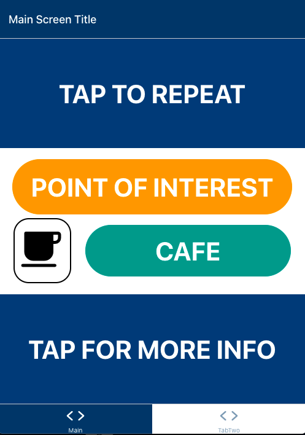

<!-- PROJECT LOGO -->
 

   

  <h1 align="center">NarrateMyWay</h1>

  

    We are a group of 5th Year Electronics & Software Engineering students at the University of Glasgow, completing a project to create a navigation application. Our app provides audio signage, giving users a better understanding of their surrounding to improve outdoor and indoor navigation.
     
    <a href="https://ese-peasy.github.io/NarrateMyWay/"><strong>Explore the docs »</strong></a>
     
     
    <a href="https://github.com/ESE-Peasy/NarrateMyWay">View Demo</a>
    ·
    <a href="https://github.com/ESE-Peasy/NarrateMyWay/issues">Report Bug</a>
    ·
    <a href="https://github.com/ESE-Peasy/NarrateMyWay/issues">Request Feature</a>
  

<!-- TABLE OF CONTENTS -->

  
Table of Contents

  <ol>
    <li>
      <a href="#about-the-project">About The Project</a>
      <ul>
        <li><a href="#technologies-used">Technologies Used</a></li>
      </ul>
    </li>
    <li>
      <a href="#getting-started">Getting Started</a>
    </li>
    <li><a href="#usage">Usage</a></li>
    <li><a href="#roadmap">Roadmap</a></li>
    <li><a href="#contributing">Contributing</a></li>
    <li><a href="#license">License</a></li>
    <li><a href="#contact">Contact</a></li>
    <li><a href="#acknowledgements">Acknowledgements</a></li>
  </ol>

<!-- ABOUT THE PROJECT -->
## About The Project

With a large array of navigation tools currently available, NarrateMyWay aims to provide the benefits of visual signs to various groups of individuals, such as visually impaired people, tourists who may not speak the native language and pensioners who require extra mobility aids. This will give users more context to their surroundings to aid navigation and will be achieved by connecting the user's device to various Bluetooth beacons that will be placed at significant locations. Despite the technology being developed for the University of Glasgow campus, it will have the ability to be easily expanded to any location. The technologies extensibility will also be combined with the application being free and available across Andriod and IOS devices.

### Technologies Used

* The application for this project is being developed using [React Native](https://reactnative.dev)

<!-- GETTING STARTED -->
## Getting Started

To get started with installing and running the NarrateMyWay application please refer to our [development guide](https://ese-peasy.github.io/NarrateMyWay/development/development.html)

<!-- USAGE EXAMPLES -->
## Usage

### Concept User Interface

 
  

### Description

The application will produce an audio output describing the next point of interest the user is approaching. This will be dynamically represented on the user interface, specifically designed for visually impaired users. The application will allow users to decide if they want more information regarding the current point of interest or to simply hear the original audio description again. As the application is currently being developed, it is important to note that the displayed user interface is being used as a design concept and may be altered throughout development. 

_For more examples, please refer to the [Documentation](https://ese-peasy.github.io/NarrateMyWay/)_

<!-- ROADMAP -->
## Roadmap 

See the [open issues](https://github.com/ESE-Peasy/NarrateMyWay/issues) for a list of proposed features (and known issues).

<!-- CONTRIBUTING -->
## Contributing

Contributions are what make the open source community such an amazing place to be learn, inspire, and create. Any contributions you make are **greatly appreciated**.

To contribute to our project we recommend the following steps:

1. Fork the Project
2. Create your Feature Branch (`git checkout -b feature/AmazingFeature`)
3. Commit your Changes (`git commit -m 'Add some AmazingFeature'`)
4. Push to the Branch (`git push origin feature/AmazingFeature`)
5. Open a Pull Request

Please look at the [Development](https://ese-peasy.github.io/NarrateMyWay/development/development.html) page within our GitHub Pages for more detailed guidance regarding setup and tools which can be used to optimise the development experience.

<!-- LICENSE -->
## License

Distributed under the GPL-3.0 License. See [`LICENSE`](https://github.com/ESE-Peasy/NarrateMyWay/blob/main/LICENSE) for more information.

<!-- CONTACT -->
## Contacts

This project is being completed by a team of 5th Year Engineering students at the University of Glasgow:

* [Andrew Ritchie](https://github.com/Andrew-Ritchie) 
* [Ashwin Maliampurakal](https://github.com/Ashwin-MJ)
* [Conor Begley](https://github.com/C-Begley)
* [Miklas Riechmann](https://github.com/miklasr)

<!-- ACKNOWLEDGEMENTS -->
## Acknowledgements
* [Dr Marion Hersh](https://www.gla.ac.uk/schools/engineering/staff/marionhersh/)
