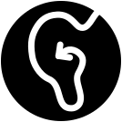

<!-- 
 
  

 -->

[Explain who we are and why we are completing the project]

We are a group of 5th Year Electronics & Software Engineering students...

## Demonstration

[Include a video or some images demonstrating the device]

## NMW Standard
We have worked towards standardising the methods for interfacing with beacons used for audio navigation. This is intended to be compatible with the [Wayfindr](https://www.wayfindr.net/) open standard.

Check out our documentation for the NMW expansion to the Wayfindr standard [here](/NMW-Standard).

## Future Plans

[Next steps for the project]

## Support or Contact

Please reach out to us [here](/about-us) if you have any questions.
