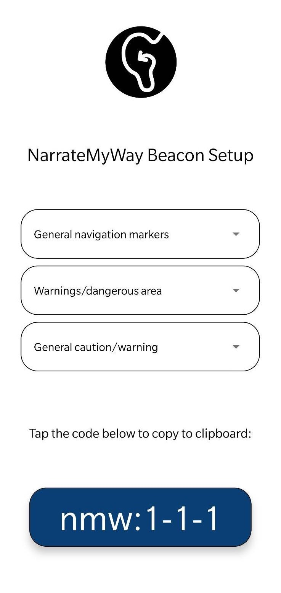

# NarrateMyWay - Setup Application

Due to the relatively complex nature of the NarrateMyWay standard and the setup process for placing new beacons around large organisations, a supplemental application has been created to aid in the process of generating the required encoding for the location.

A screenshot is shown below:

With more time, this could be extended to allow the detection of beacons and setting of beacon names directly within this app itself as demonstrated below.

<embed src="../images/NMW-Setup.pdf" type="application/pdf" width="100%" height="600px" />
